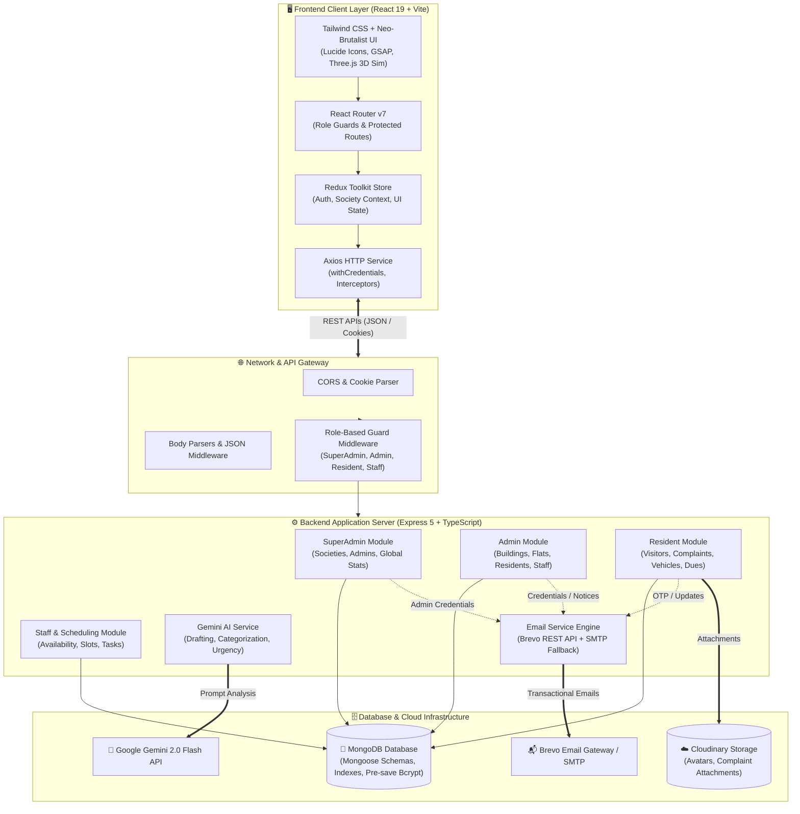
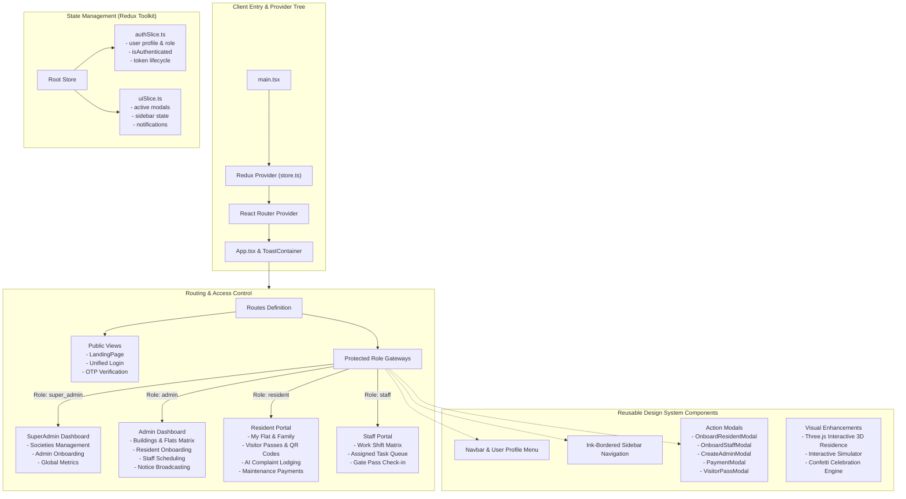
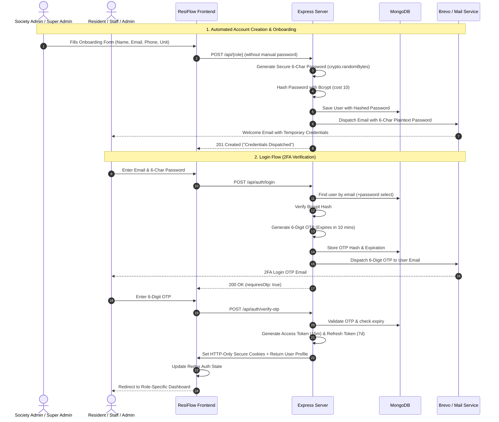
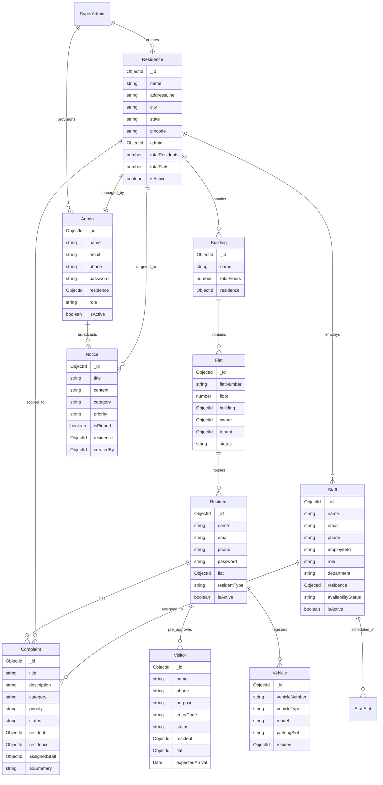

# 🏢 ResiFlow — Smart Residence Management Platform

[](https://www.typescriptlang.org/)
[](https://react.dev/)
[](https://nodejs.org/)
[](https://expressjs.com/)
[](https://mongoosejs.com/)
[](https://tailwindcss.com/)
[](LICENSE)

**ResiFlow (Smart Residence)** is an enterprise-ready residential society and facility management ecosystem built with a high-contrast ink-bordered aesthetic. It orchestrates multi-tenant society management, role-based access control with 2-Factor OTP verification, automated randomized credential onboarding, Google Gemini AI complaint analysis, staff slot scheduling, visitor QR passcodes, and maintenance tracking.

---

## 📑 Table of Contents

1. [High-Level System Architecture](#-high-level-system-architecture)
2. [Backend Architecture & Component Details](#-backend-architecture--component-details)
3. [Frontend Architecture & Component Details](#-frontend-architecture--component-details)
4. [Authentication & Onboarding Flow](#-authentication--onboarding-flow)
5. [Database & Entity-Relationship Model](#-database--entity-relationship-model)
6. [Key Features & Capabilities](#-key-features--capabilities)
7. [Tech Stack Matrix](#-tech-stack-matrix)
8. [Environment Setup & Installation](#-environment-setup--installation)
9. [Available Scripts](#-available-scripts)
10. [Folder Structure](#-folder-structure)

---

## 🏛️ High-Level System Architecture



---

## ⚙️ Backend Architecture & Component Details

The backend is structured around a modular domain-driven pattern inside `server/src/`, ensuring clean separation between Routing, Validation, Controller Logic, Middleware, and Database Models.

```mermaid
graph TD
    subgraph CoreEngine["Server Core (server/src/index.ts)"]
        ExpressApp["Express Application Instance"]
        Middlewares["Global Middlewares\n- cors({ credentials: true })\n- express.json()\n- cookieParser()"]
        ErrorHandler["Global Error Handler & ApiError Wrapper"]
    end

    subgraph SecurityModule["Security & Authentication Subsystem"]
        Guards["Guard Middlewares\n- SuperAdminGuard\n- AdminGuard\n- ResidentGuard\n- StaffGuard\n- AdminStaffGuard"]
        JWTUtil["JWT Engine (jwt.util.ts)\n- Access Token (Short-lived)\n- Refresh Token (Long-lived)\n- HTTP-only Cookies"]
        PasswordUtil["Password Engine (password.util.ts)\n- 6-Char Cryptographic Randomizer\n- Mongoose Pre-save Bcrypt Hashing"]
    end

    subgraph DomainModules["Feature Modules"]
        subgraph SuperAdmin["SuperAdmin Domain"]
            SARoute["/api/super-admin"] --> SAController["super-admin.controller.ts"]
            SAController --> SAModel["super-admin.schema.ts"]
        end

        subgraph Admin["Admin Domain"]
            ARoute["/api/admin"] --> AController["admin.controller.ts"]
            AController --> AModel["admin.schema.ts"]
        end

        subgraph ResidenceStructure["Society & Housing Hierarchy"]
            RRoute["/api/residence"] --> RModel["residence.model.ts"]
            BRoute["/api/building"] --> BModel["building.schema.ts"]
            FRoute["/api/flat"] --> FModel["flat.model.ts"]
        end

        subgraph UserDomains["User Domains"]
            ResRoute["/api/resident"] --> ResController["resident.controller.ts"] --> ResModel["resident.model.ts"]
            StaffRoute["/api/staff"] --> StaffController["staff.controller.ts"] --> StaffModel["staff.model.ts"]
        end

        subgraph OperationsDomains["Operations & Facility Domains"]
            CompRoute["/api/complaint"] --> CompController["complaint.controller.ts"] --> CompModel["complaint.model.ts"]
            NotRoute["/api/notice"] --> NotController["notice.controller.ts"] --> NotModel["notice.model.ts"]
            VisRoute["/api/visitor"] --> VisController["visitor.controller.ts"] --> VisModel["visitor.model.ts"]
            VehRoute["/api/vehicle"] --> VehController["vehicle.controller.ts"] --> VehModel["vehicle.model.ts"]
        end
    end

    subgraph Integrations["External Services & Helpers"]
        Mail["mail.util.ts\n- dispatchEmail()\n- sendAccountCredentialsMail()\n- sendOtpMail()\n- sendNoticeMail()"]
        AI["gemini.util.ts\n- GoogleGenAI SDK\n- Complaint analysis prompt"]
        Cloud["cloudinary.util.ts\n- Multer disk storage -> Cloudinary stream"]
    end

    ExpressApp --> Middlewares
    Middlewares --> SARoute & ARoute & RRoute & BRoute & FRoute & ResRoute & StaffRoute & CompRoute & NotRoute & VisRoute & VehRoute
    SARoute & ARoute & RRoute & BRoute & FRoute & ResRoute & StaffRoute & CompRoute & NotRoute & VisRoute & VehRoute --> Guards
    Guards --> SecurityModule
    SAController & ResController & StaffController --> PasswordUtil
    SAController & AController & ResController & StaffController --> Mail
    CompController --> AI
```



### Backend Highlights:
- **Async Safety**: All controllers are wrapped in `asyncHandler` with standard `ApiResponse` and `ApiError` formatters.
- **Dual Email Engine**: Brevo v3 HTTP API with automatic fallback to Nodemailer SMTP for flawless zero-drop transactional email delivery.
- **Automated Password Generation**: Cryptographically secure 6-character random alphanumeric passwords generated on creation for Admins, Residents, and Staff, immediately dispatched to their respective email inboxes while only the bcrypt hash is stored in MongoDB.

---

## 🖥️ Frontend Architecture & Component Details

The frontend client is built with **React 19**, **Vite**, **TypeScript**, and styled using an ink-bordered, neo-brutalist design with **Tailwind CSS v4**.



---

## 🔐 Authentication & Onboarding Flow

ResiFlow uses a secure **Two-Step Authentication (2FA)** pipeline for logging in, coupled with an **Automated Randomized Password & Email Onboarding** flow for new members.



---

## 🗄️ Database & Entity-Relationship Model



---

## 🌟 Key Features & Capabilities

| Module | Features |
|---|---|
| **Multi-Tenancy** | Independent societies managed by assigned Admins under SuperAdmin supervision. |
| **Randomized Onboarding** | 6-character random password auto-generation dispatched straight to user inboxes. |
| **Two-Factor Authentication** | Dual-step email OTP verification on every login for all roles. |
| **AI Complaint Assistant** | Google Gemini 2.0 integration for auto-categorizing issues and assessing urgency. |
| **Smart Staff Slotting** | Working hour matrices, duty shifts, and slot availability tracking. |
| **Visitor Pass & QR** | Pre-approvals with verification passcodes and live guard check-in. |
| **Financial Simulator** | Interactive dues tracking, monthly maintenance billing, and payment simulation. |
| **Notice Broadcasts** | Emergency and general announcements with instant multi-resident email dispatch. |
| **Interactive 3D Simulator** | Three.js interactive building and society rendering on the portal homepage. |

---

## 🛠️ Tech Stack Matrix

### Frontend
- **Framework**: React 19 (TypeScript) + Vite 8
- **State Management**: Redux Toolkit & React-Redux
- **Routing**: React Router DOM v7
- **Styling**: Tailwind CSS v4, Remix Icon, Lucide React
- **Animations & Visuals**: Three.js, GSAP, Canvas Confetti
- **HTTP Client**: Axios with interceptors and cookie credentials

### Backend
- **Runtime & Framework**: Node.js + Express 5 (TypeScript)
- **Database & ODM**: MongoDB + Mongoose 9
- **Authentication**: JSON Web Tokens (`jsonwebtoken`), `bcrypt` password hashing, `cookie-parser`
- **Email Delivery**: Brevo v3 REST API (`@getbrevo/brevo` compatible endpoints) + Nodemailer SMTP fallback
- **Artificial Intelligence**: `@google/genai` (Gemini 2.0 Flash)
- **File Uploads**: Cloudinary SDK + Multer
- **Validation & CLI**: Zod, Inquirer

---

## 🚀 Environment Setup & Installation

### Prerequisites
- **Node.js**: v18.0.0 or higher
- **npm**: v9.0.0 or higher
- **MongoDB**: Local MongoDB community instance or MongoDB Atlas cluster URI

---

### 1. Backend Setup (`/server`)

1. Navigate to the server folder:
   ```bash
   cd server
   ```
2. Install dependencies:
   ```bash
   npm install
   ```
3. Create `.env` in `server/.env`:
   ```env
   PORT=5000
   DB_URL=mongodb://127.0.0.1:27017/smart-residence
   
   # JWT Configuration
   JWT_ACCESS_SECRET=your_super_secret_access_jwt_key_12345
   JWT_REFRESH_SECRET=your_super_secret_refresh_jwt_key_67890
   
   # Email Service (Brevo API & SMTP Fallback)
   BREVO_API_KEY=your_brevo_v3_api_key_here
   BREVO_USER=your_verified_sender_email@domain.com
   SMTP_HOST=smtp-relay.brevo.com
   SMTP_PORT=587
   SMTP_EMAIL=your_smtp_login_here
   SMTP_PASS=your_smtp_password_here
   
   # AI Integration (Optional for AI complaint analysis)
   GEMINI_API_KEY=your_gemini_api_key_here
   
   # Cloudinary (Optional for file uploads)
   CLOUDINARY_CLOUD_NAME=your_cloud_name
   CLOUDINARY_API_KEY=your_cloudinary_key
   CLOUDINARY_API_SECRET=your_cloudinary_secret
   ```
4. Seed the initial Super Admin account:
   ```bash
   npm run seed:admin
   ```
5. Start the development server:
   ```bash
   npm run dev
   ```

---

### 2. Frontend Setup (`/client`)

1. Navigate to the client folder:
   ```bash
   cd client
   ```
2. Install dependencies:
   ```bash
   npm install
   ```
3. Create `.env` in `client/.env`:
   ```env
   VITE_API_URL=http://localhost:5000/api
   ```
4. Start the frontend development server:
   ```bash
   npm run dev
   ```
5. Open your browser and navigate to `http://localhost:5173`.

---

## 📜 Available Scripts

### In `/server`
- `npm run dev` — Starts server with nodemon hot-reload.
- `npm run build` — Compiles TypeScript into JavaScript inside `dist/`.
- `npm start` — Runs the compiled production server.
- `npm run seed:admin` — Interactive CLI prompt to initialize the Super Admin.

### In `/client`
- `npm run dev` — Starts the Vite development server.
- `npm run build` — Type-checks and builds the production bundle into `dist/`.
- `npm run preview` — Locally preview the production build.

---

## 📁 Folder Structure

```
SmartResidence/
├── client/                     # React 19 Frontend
│   ├── src/
│   │   ├── assets/             # Static images and icons
│   │   ├── components/         # Reusable UI components & modals
│   │   │   ├── Modals/         # Form and payment modals
│   │   │   ├── Navbar.tsx
│   │   │   ├── Sidebar.tsx
│   │   │   └── InteractiveSimulator.tsx
│   │   ├── pages/              # Route views
│   │   │   ├── auth/           # Login & 2FA OTP pages
│   │   │   ├── dashboard/      # SuperAdmin & Admin dashboards
│   │   │   ├── residents/      # Resident management
│   │   │   ├── staff/          # Staff & slot management
│   │   │   ├── complaints/     # AI complaints desk
│   │   │   ├── visitors/       # Visitor log & QR passes
│   │   │   ├── vehicles/       # Parking & vehicles
│   │   │   └── landing/        # Landing page with 3D residence
│   │   ├── redux/              # Redux slices & store configuration
│   │   ├── services/           # Axios instance & API caller methods
│   │   ├── App.tsx             # Root router & layout wrapper
│   │   └── main.tsx            # React application entry
│   └── package.json
│
├── server/                     # Node.js + Express Backend
│   ├── src/
│   │   ├── admin/              # Society Admin controller & schema
│   │   ├── super-admin/        # Platform SuperAdmin controller & schema
│   │   ├── residence/          # Society instances & settings
│   │   ├── building/           # Building & tower management
│   │   ├── flat/               # Flat units & occupancy
│   │   ├── resident/           # Resident controller & schema
│   │   ├── staff/              # Staff & scheduling services
│   │   ├── complaint/          # Complaints desk & AI integration
│   │   ├── notice/             # Society bulletin broadcast
│   │   ├── visitor/            # Visitor passcodes & check-in
│   │   ├── vehicle/            # Vehicle registry & parking
│   │   ├── middleware/         # Guard & auth middlewares
│   │   ├── utils/              # Mail, JWT, Password, Gemini & Cloudinary helpers
│   │   ├── scripts/            # CLI database seeding scripts
│   │   └── index.ts            # Express server initialization
│   └── package.json
│
└── README.md                   # Project documentation
```

---

## 📄 License

This project is licensed under the **MIT License**.
